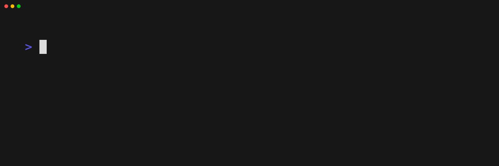

# Home Assistant Example

## Overview

The Home Assistant example provides a production-ready deployment of Home Assistant on Talos, with persistent storage and Kubernetes-based management. Out of the box, you get a working Home Assistant instance accessible via port 8123, with data stored persistently and reproducible setup using Windsor CLI and Kustomize.

**Planned Features:**

- Automatic SSL configuration
- Add-on support
- Integration with other services
- Backup and restore capabilities

## Getting Started

After deploying Home Assistant, you'll be greeted with the onboarding screen where you can set up your initial configuration. This includes creating your admin account, setting your location, and configuring basic system settings.


## Directory Structure Details

The `home-automation` folder is structured to organize the configuration and resources needed for deploying Home Assistant using the [Windsor CLI](https://windsorcli.github.io). Below is a tree view of the `home-automation` directory and a description of the files within the `home-assistant` subfolder.

```
home-automation/
├── .windsor/                 # Windsor CLI configuration and state
├── .volumes/                 # Persistent volume data
├── contexts/                 # Environment-specific configurations
├── images/                   # Documentation and example images
├── kustomize/                # Kubernetes manifests and Kustomize overlays
│   └── home-automation/      # Home automation specific configurations
│       └── home-assistant/   # Home Assistant deployment files
│           ├── ingress.yaml         # Ingress configuration for web access
│           ├── kustomization.yaml   # Kustomize configuration
│           ├── namespace.yaml       # Kubernetes namespace definition
│           ├── helm-release.yaml    # Helm chart release configuration
│           └── helm-repository.yaml # Helm repository configuration
├── terraform/                # Infrastructure as Code configurations
├── .gitignore                # Git ignore rules
├── Taskfile.yml              # Task definitions for common operations
├── windsor.yaml              # Windsor project configuration
└── README.md                 # Project documentation
```

### Root Level Files
- `Taskfile.yml`: Contains task definitions for common operations like initialization, startup, and shutdown
- `windsor.yaml`: Main configuration file for the Windsor project, defining the project structure and dependencies
- `README.md`: Project documentation and setup instructions
- `.gitignore`: Specifies which files Git should ignore

### Key Directories

#### `.windsor/`
Contains Windsor CLI configuration and state files. This directory is managed by Windsor and should not be modified manually.

#### `.volumes/`
Stores persistent volume data for Home Assistant. This ensures your configuration and data persist between restarts.

#### `contexts/`
Contains environment-specific configurations. This allows for different settings in development, staging, and production environments.

#### `kustomize/`
Houses all Kubernetes manifests and Kustomize overlays. The structure follows a hierarchical pattern:

- `home-automation/`: Contains configurations specific to home automation
  - `home-assistant/`: Contains the actual deployment files for Home Assistant
    - `ingress.yaml`: Configures external access to the Home Assistant web interface
    - `kustomization.yaml`: Defines how to customize the base configuration
    - `namespace.yaml`: Creates a dedicated Kubernetes namespace
    - `helm-release.yaml`: Configures the Home Assistant Helm chart installation
    - `helm-repository.yaml`: Adds the required Helm repository

#### `terraform/`
Contains Infrastructure as Code (IaC) configurations for provisioning the underlying infrastructure.

### Configuration
The Home Assistant specific configuration settings are as follows:

#### blueprint.yaml
```yaml
kustomize:
- name: ha
  path: home-automation/home-assistant
  force: true
```
## Deployment Flow

1. The Windsor CLI uses the `windsor.yaml` configuration to understand the project structure
2. When `windsor init local` is run, it sets up the local environment
3. `windsor up --install` deploys the Home Assistant stack using the Kustomize configurations
4. The ingress configuration makes Home Assistant accessible via port 8123
5. Persistent data is stored in the `.volumes/` directory

This structure allows for:

- Clear separation of concerns
- Easy environment-specific customization
- Persistent data storage
- Reproducible deployments
- Infrastructure as Code practices

## Usage

### Initialize a new local context
```
windsor init local
```


### Bring up a cluster and install all kustomizations
```
windsor up --install
```


### Access Home Assistant via Port Forwarding
```
kubectl port-forward --address 0.0.0.0 svc/home-assistant -n home-assistant 8123:8123
```


### Wait for ha pod to become ready



### Visit: http://localhost:8123
```
open http://localhost:8123
```

### Stop the cluster
```
windsor down 
```

