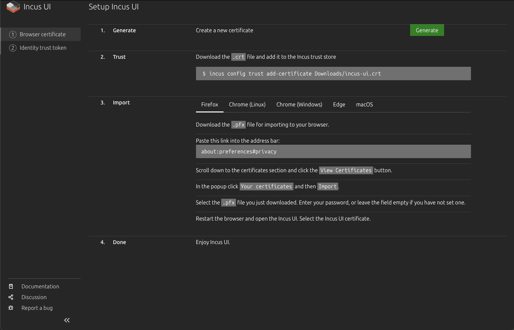

# Installing IncusOS on Intel NUC

This guide walks you through installing and configuring [IncusOS](https://linuxcontainers.org/incus-os/docs/main/getting-started/) on an [Intel NUC](https://www.intel.com/content/www/us/en/products/boards-kits/nuc.html) device. IncusOS is a dedicated operating system designed specifically for running Incus, providing a streamlined platform for container and virtual machine management.

## Overview

Installing IncusOS on an Intel NUC involves:

1. **Downloading the IncusOS image**: Creating a custom image from the IncusOS Customizer
2. **Setting Windsor context**: Initialize the workspace context with `windsor init` and `windsor context set`
3. **Updating windsor.yaml**: Configuring workspace variables including the image path and USB disk
4. **Preparing the image in workspace**: Copying the image with `task device:prepare-incus-image`
5. **Preparing the NUC**: Updating BIOS, configuring Secure Boot, and wiping existing storage
6. **Creating the boot media**: Writing the IncusOS image to a USB device
7. **Booting and installing**: Booting from USB and installing IncusOS to the NUC's storage
8. **Generating a trust token**: Creating a token on the NUC for CLI authentication
9. **Connecting to Incus**: Setting up the Incus CLI client and connecting to the server
10. **Configuring network**: Setting up direct network attachment for VMs
11. **Accessing web UI**: Setting up and accessing the Incus web interface
12. **Getting certificates**: Retrieving client certificates (optional)

IncusOS provides a complete, dedicated operating system optimized for running Incus, making it ideal for production deployments where you want a minimal, purpose-built platform.

## Prerequisites

Before starting, ensure you have:

- **Intel NUC BIOS updated** (recommended): Follow [Update the Intel NUC BIOS](./nuc-bios.md) before installing IncusOS
- **Intel NUC device**: Compatible Intel NUC (x86_64 architecture, 5 years old or newer)
- **USB memory device**: At least 8GB capacity (16GB or larger recommended) for the boot media
- **Computer with macOS or Linux**: For preparing the boot media and running the Incus CLI
- **Network connectivity**: The Intel NUC must be able to connect to your network via Ethernet
- **TPM 2.0**: The NUC must have a TPM 2.0 security module
- **UEFI with Secure Boot support**: Required for IncusOS installation
- **At least 50GiB of storage**: On the NUC's internal storage device
- **Physical access**: To the NUC for BIOS configuration and boot media insertion
- **Windsor workspace**: Clone or open the workspace repository
- **Required tools**: Incus CLI (`lxc/incus`), Terraform, and other tools (see [Installation Guide](../../install.md)); the Windsor project recommends [aqua](https://aquaproj.github.io/) for tool management

## System Requirements

IncusOS requires modern system features and will not function properly on older unsupported systems:

- Modern x86_64 or ARM64 system (5 years old at most)
- Support for UEFI with Secure Boot
- TPM 2.0 security module
- At least 50GiB of storage
- At least one wired network port

## Step 1: Download the IncusOS image

### Determine installed drives (for customizer settings)

Before configuring the IncusOS Customizer, identify which drives are in your NUC so you can set the correct target drive identifier. The customizer matches drives by their `/dev/disk/by-id/` names.

If the NUC already runs Linux (or you boot it from an Ubuntu Live USB), run:

```bash
# List all drives by persistent ID
ls -la /dev/disk/by-id/

# Filter for NVMe drives (M.2 blade SSD)
ls -la /dev/disk/by-id/ | grep nvme

# Filter for SATA drives (2.5" bay)
ls -la /dev/disk/by-id/ | grep -E 'ata-|scsi-|wwn-'
```

Example output for a NUC with one NVMe and one SATA drive:

```
nvme-WD_BLACK_SN850X_1000GB_23436M801614      -> ../../nvme0n1
nvme-WD_BLACK_SN850X_1000GB_23436M801614-part1 -> ../../nvme0n1p1
ata-SPCC_Solid_State_Disk_AA230815S325622103  -> ../../sda
```

Use a **partial match** of the `by-id` name as the customizer's target. For a single NVMe drive, `nvme-` is usually sufficient. For multiple NVMe drives, use a more specific prefix (e.g., `nvme-WD_BLACK`). Omit USB devices and partitions when choosing the target.

If you cannot boot the NUC before creating the image, use `nvme-` when the NUC has an M.2 NVMe drive (typical for NUC8ixBEH and similar models).

### Download from IncusOS Customizer

Visit the [IncusOS Customizer](https://incusos-customizer.linuxcontainers.org/ui/) to create a custom IncusOS image tailored to your needs.

#### Recommended settings for Intel NUC

Use these settings when generating the image for installation on an Intel NUC:

| Setting | Recommended value | Notes |
|---------|-------------------|-------|
| **Image type** | USB | |
| **Image Usage** | Installation | |
| **Image Architecture** | x86_64 | |
| **Image Application** | Incus | |
| **Wipe the target drive** | Enabled | Erases existing partitions and data on the target disk before installing. Use this for a clean install; disable only if preserving data. |
| **Automatically reboot after installation** | Enabled | Reboots the system once installation completes, so you don't need to manually remove the USB and power cycle. |
| **Target drive identifier** | `nvme-` | Targets the NVMe drive (the M.2 blade SSD). The NUC's NVMe appears as `/dev/disk/by-id/nvme-*`; a partial match of `nvme-` selects it when only one NVMe is present. Omit or leave empty if the NUC has a single internal drive. |
| **Apply default configuration** | Enabled | |
| **Certificate** | Required | Generate and add a client certificate so Incus trusts your machine when you first connect. See below. |

#### Generate the client certificate

Before configuring the customizer, generate a client certificate on your Mac so IncusOS will trust your machine when you first add the remote. Without this, you must generate a trust token on the NUC console (Step 8).

1. **Ensure the Incus client is installed** (e.g., `aqua install` or Homebrew).

2. **Create the client certificate** (if you don't have one yet):

   ```bash
   incus remote generate-certificate
   ```

   This creates `~/.config/incus/client.crt` and `client.key`. If certificates already exist, skip to the next step.

3. **Retrieve the certificate for the customizer**:

   ```bash
   incus remote get-client-certificate
   ```

   This prints the certificate. Copy the full output (including `-----BEGIN CERTIFICATE-----` and `-----END CERTIFICATE-----`).

4. **Add the certificate in the IncusOS Customizer** — In the certificate / TLS client certificate section, paste the certificate or use the customizer's "Generate" or "Add" option to include it in the image. The customizer will embed it in the install seed so Incus trusts your machine when it first starts.

With the certificate embedded, you can add the remote in Step 9 without needing a trust token from the NUC console.

If your NUC has both NVMe and SATA drives, `nvme-` ensures IncusOS installs to the faster NVMe drive. To target a specific NVMe drive (e.g., when multiple are present), use a more specific partial match from `/dev/disk/by-id/` such as `nvme-WD_BLACK` or the full by-id name.

1. Configure your image settings (including the options above)
2. Download the generated image file (typically named like `IncusOS_YYYYMMDDHHMM.img`)

**Note**: After downloading, note the full path to the image file. You'll need this for Step 3.

## Step 2: Set Windsor context

Initialize and set the `nuc-incusos` context:

```bash
windsor init nuc-incusos
windsor context set nuc-incusos
```

## Step 3: Update windsor.yaml

### Determine the target disk

Use `task device:list-disks` to get a list of disks. Set the `USB_DISK` environment variable accordingly.

### Add variables to windsor.yaml

Add or update the `environment` section in `contexts/nuc-incusos/windsor.yaml`:

```yaml
environment:
  INCUS_REMOTE_NAME: "nuc"
  USB_DISK: "/dev/disk4"

  # Path to the downloaded IncusOS image file (from Step 1)
  INCUS_IMAGE_FILE: "/Users/$USER/Downloads/IncusOS_202601260318.img"
  INCUS_REMOTE_IP_0: "192.168.2.101 [or 170]"
```

Replace the placeholder values with your actual configuration:

- `USB_DISK`: The device identifier for your USB memory device (use `task device:list-disks` to identify it)
- `INCUS_IMAGE_FILE`: The path to your downloaded IncusOS image file
- `INCUS_REMOTE_IP_0`: IP address for the Incus server (used by deployment runbooks)

## Step 4: Prepare the image in the workspace

Copy the downloaded image to the workspace devices folder:

```bash
task device:prepare-incus-image
```

This copies the image file specified in `INCUS_IMAGE_FILE` to `contexts/nuc-incusos/devices/incus/incusos.img`.

## Step 5: Prepare the Intel NUC

### Update the BIOS

Before installing IncusOS, ensure your NUC's BIOS is up to date. Follow the full runbook for step-by-step instructions:

**[→ Update the Intel NUC BIOS](./nuc-bios.md)**

### Wipe existing storage

If the NUC previously had Ubuntu or another operating system installed, you should wipe the storage device before installing IncusOS. This ensures a clean installation without bootloader or partition conflicts.

**Boot from USB first**: You cannot wipe the boot disk while the system is running from it. Boot the NUC from an Ubuntu install disk (USB), and when prompted choose **"Try Ubuntu"** (do not install). This runs Ubuntu from the USB so the internal drives can be wiped. See the [Ubuntu Setup](./nuc-ubuntu.md) runbook for creating an Ubuntu bootable USB if needed.

**Warning**: This will destroy all data on the storage device. Ensure you have backups of any important data.

```bash
# From Ubuntu Live (Try Ubuntu) session
# Identify the storage device first
lsblk
# or
sudo fdisk -l

# Wipe the partition table (replace /dev/nvme0n1 with your device)
sudo wipefs -a /dev/nvme0n1
sudo wipefs -a /dev/sda
```

**Note**: After wiping, if you reboot the NUC, you should see "A bootable device has not been detected." — this confirms the storage has been wiped and is ready for IncusOS installation.

### Configure Secure Boot

Access the NUC's BIOS settings (typically by pressing F2 during boot):

1. Navigate to the **Boot** tab in BIOS settings
2. In the **Secure Boot** section:
   - Select **"Custom"** Secure Boot Mode
   - Select **"Reset to Setup Mode"** to enable custom mode

   NOTE: The two nucs I have are different.  The point here is to cause the previous secure keys to be regenerated the next time we boot on the USB device.

3. In the **Boot Priority** section:
   - Select **"Boot USB devices First"** to prioritize USB boot
   - Enable **"USB"** booting if not already enabled

**Important**: Secure Boot must be configured in "Custom" mode for IncusOS to install and boot properly.

## Step 6: Prepare USB boot device

### Write IncusOS image to USB

Write the IncusOS image to your USB memory device. This process will erase all existing data on the device.

```bash
task device:write-incus-disk [-- 1]
```

To write to multiple USB devices in parallel (e.g., 3 devices starting from `USB_DISK`):

```bash
task device:write-incus-disk -- 3
```

### Eject the USB device

After writing completes, safely eject the device(s):

```bash
task device:eject-disk [-- 1]
```

The `eject-disk` task will automatically unmount the disks before ejecting them.

## Step 7: Boot and install IncusOS

1. **Insert the boot media**: Insert the USB memory device into a USB port on your Intel NUC
2. **Connect network**: Ensure the Intel NUC is connected to your network via Ethernet
3. **Power on**: Connect power to the Intel NUC and turn it on
4. **Boot from USB**: The NUC should automatically boot from USB if configured correctly, or use the boot menu (typically F10) to select the USB device
5. **Wait for installation**: IncusOS will boot and begin installation to the internal storage device
6. **Note the IP address**: After installation completes, the NUC will display its IP address on the console, or you can find it via your router's DHCP client list

**Note**: The installation process will automatically install IncusOS to the internal storage device. After installation completes and the system reboots, you can remove the USB boot device.

## Step 8: Generate trust token (if needed)

If you embedded a client certificate in the IncusOS Customizer (Step 1), you can skip this step and go to Step 9.

Otherwise, generate a trust token on the NUC so you can add the remote from your Mac. The token must be created on the **same** Incus server you are connecting to.

### Option A: Physical console on the NUC

At the NUC's physical console, run:

```bash
incus config trust add <remote-name>
```

Replace `<remote-name>` with the name you'll use when adding the remote (e.g., `nuc`). Copy the token output; you'll paste it when running `incus remote add` in Step 9.

### Option B: Incus Web UI

1. Open a browser and go to `https://<nuc-ip-address>:8443`
2. Accept the certificate warning if prompted
3. On the setup page, use the **"Add token"** or **"Trust"** section to generate a token
4. Copy the token; you'll paste it when running `incus remote add` in Step 9



## Step 9: Connect to Incus server

### Add the remote server

Add your Incus server as a remote:

```bash
incus remote add <remote-name> https://<nuc-ip-address>:8443
```

Replace:
- `<remote-name>` with a name for this remote (e.g., `nuc`, `incus-server`, `forest-shadows`)
- `<nuc-ip-address>` with the actual IP address of your NUC (e.g., `192.168.2.101`)

Example:

```bash
incus remote add nuc https://192.168.2.101:8443
```

### Trust the certificate

When adding the remote, you'll be prompted to accept the server's certificate. Type `yes` to trust the certificate.

If you need to trust the certificate later:

```bash
incus remote set-url <remote-name> https://<nuc-ip-address>:8443
```

### Verify connection

List your remotes to verify the connection:

```bash
incus remote list
```

You should see your new remote listed. Test the connection:

```bash
# List instances (should be empty initially)
incus list <remote-name>:

# Get server information
incus info <remote-name>:
```

### Set as default remote

**Important**: The following steps rely on setting the current remote to the NUC.

If you want to make this your default remote:

```bash
incus remote switch <remote-name>
```

After switching, you can omit the remote name in commands:

```bash
incus list
incus info
```

## Step 10: Configure direct network attachment

To allow VMs to get IP addresses directly on your physical network, you need to configure a physical network interface for direct attachment. This creates a network that bypasses NAT and connects VMs directly to your physical network.

### View current network configuration

First, check the current network configuration:

```bash
incus admin os system network show
```

This shows your network interfaces and their current roles.

### Add instances role to physical interface

Edit the network configuration to add the `instances` role to your physical network interface (typically `eno1` or `eth0`):

```bash
incus admin os system network edit
```

In the editor, find your physical interface (e.g., `eno1`) in the `config.interfaces` section. **Add a `roles` field** if it doesn't exist, and include `instances` in the list:

```yaml
config:
  interfaces:
  - addresses:
    - dhcp4
    - slaac
    hwaddr: 88:ae:dd:03:f9:f4
    name: eno1
    required_for_online: "no"
    roles:          # Add this field if it doesn't exist
    - management
    - cluster
    - instances     # Add this line
...
state:
  interfaces:
    eno1:
      addresses:
      - 192.168.2.101
      - fd55:b018:d18b:462e:8aae:ddff:fe03:f9f4
      hwaddr: 88:ae:dd:03:f9:f4
      mtu: 1500
      roles:
      - management
      - cluster
      - instances    
```

**Important**:
- The `roles` field must be added to the `config.interfaces` section (not just the `state` section)
- Make sure the YAML indentation is correct (2 spaces)
- Save the file (in vim: press `Esc`, then type `:wq` and press Enter; in nano: press `Ctrl+X`, then `Y`, then Enter)

After saving, the configuration will be applied automatically. Verify the change:

```bash
incus admin os system network show
```

You should see `instances` in the `state.interfaces.eno1.roles` list.

### Create physical network

After the configuration is applied, create a managed physical network:

```bash
task incus:create-physical-network
```

This creates a physical network that directly attaches to your host's network interface, allowing VMs to get IP addresses directly from your physical network's DHCP server.

**Note**:
- If the physical network already exists, the task will verify it's correctly configured and skip creation. If you need to recreate it, delete it first with `incus network delete <remote-name>:<interface-name>`.
- Replace `eno1` with your actual physical network interface name if different. Common interface names include `eno1`, `eth0`, `enp5s0`, etc.
- You can override the interface name by setting the `PHYSICAL_INTERFACE` environment variable in your `windsor.yaml` file.
- After this step, VMs launched with this network will get IP addresses directly from your physical network's DHCP server, bypassing NAT.

## Step 11: Access Incus web UI

Incus provides a web-based user interface that you can access through your browser. To use the web UI, you'll need to set up browser certificate authentication.

### Access the setup page

Open your web browser and navigate to:

```
https://<nuc-ip-address>:8443
```

Replace `<nuc-ip-address>` with your NUC's IP address (e.g., `https://192.168.2.101:8443`).

You'll be presented with the Incus UI setup page, which guides you through the certificate setup process:


### Generate certificate

1. On the setup page, click the **"Generate"** button in the "1. Generate" section
2. This creates a new certificate for browser access
3. The certificate files (`.crt` and `.pfx`) will be available for download

### Trust certificate (CLI)

Add the certificate to the Incus CLI trust store so you can use the CLI with the same certificate:

```bash
# Download the .crt file first, then add it to trust store
incus config trust add-certificate /Users/$USER/Downloads/incus-ui.crt
```

Replace `/Users/$USER/Downloads/incus-ui.crt` with the actual path where you downloaded the certificate file.

### Import certificate to browser

To access the Incus UI through your browser, you need to import the certificate into your browser:

1. **Download the `.pfx` file** from the setup page
2. **Import into your browser** (instructions vary by browser):

   **Firefox:**
   - Navigate to `about:preferences#privacy` in the address bar
   - Scroll down to the "Certificates" section
   - Click **"View Certificates"**
   - In the popup, click **"Your certificates"** tab
   - Click **"Import"**
   - Select the `.pfx` file you downloaded
   - Enter the password (or leave empty if no password was set)
   - Restart Firefox

   **Chrome/Edge (Linux/Windows):**
   - Open browser settings
   - Navigate to Privacy and Security → Security → Manage certificates
   - Click **"Your certificates"** tab
   - Click **"Import"**
   - Select the `.pfx` file
   - Enter the password if prompted
   - Restart the browser

   **macOS (Safari/Chrome):**
   - Open Keychain Access application
   - Select "login" keychain
   - Go to File → Import Items
   - Select the `.pfx` file
   - Enter the password if prompted
   - Restart your browser

3. **Restart your browser** after importing the certificate
4. **Access the Incus UI**: Navigate to `https://<nuc-ip-address>:8443` again
5. **Select the certificate**: When prompted, select the Incus UI certificate you just imported

### Using the web UI

Once the certificate is imported and you've restarted your browser, you can:

- Access the Incus UI at `https://<nuc-ip-address>:8443`
- Manage instances (containers and VMs) through the web interface
- View storage pools, networks, and profiles
- Monitor system resources and instance status
- Create, start, stop, and delete instances
- Access instance consoles

The web UI provides a graphical interface for all Incus operations, making it easy to manage your infrastructure without using the command line.

## Step 12: Get client certificate (optional)

If you need to retrieve the client certificate for authentication or documentation purposes:

```bash
incus remote get-client-certificate <remote-name>
```

This will display the client certificate that was generated when you first connected to the server.

## Verification

Verify your Incus installation is working correctly:

```bash
# Check server information
incus info

# List storage pools
incus storage list

# List networks
incus network list

# List available images
incus image list images:

# Test creating an instance
incus launch images:ubuntu/24.04 test-instance
incus list
incus delete test-instance
```

Your Incus server should be fully operational and ready for use.

## Getting device information

When working with Incus, you may need to identify storage devices by their persistent IDs rather than device names like `/dev/nvme0n1`. Incus uses persistent device identifiers to ensure consistent device naming.

### List devices by ID

```bash
# List all devices with persistent IDs
ls -la /dev/disk/by-id/

# Filter for NVMe devices
ls -la /dev/disk/by-id/ | grep nvme

# Filter for SATA devices
ls -la /dev/disk/by-id/ | grep sda
```

Example output:

- `nvme-WD_BLACK_SN850X_1000GB_23436M801614` — NVMe device with model and serial
- `nvme-eui.e8238fa6bf530001001b448b4ce05e8e` — NVMe EUI identifier
- `ata-SPCC_Solid_State_Disk_AA230815S325622103` — SATA device identifier

These persistent IDs are useful when configuring storage pools or referencing devices in Incus configurations, as they remain consistent across reboots and system changes.

## Troubleshooting

### NUC not booting from USB

- Verify USB boot is enabled in BIOS/UEFI settings
- Check that "Boot USB devices First" is selected in boot priority
- Try a different USB port on the NUC
- Verify the image was written correctly to the USB device
- Ensure the USB device is properly formatted and recognized by the BIOS

### Secure Boot issues

- Verify Secure Boot is set to "Custom" mode, not "Standard"
- Ensure "Reset to Setup Mode" has been selected
- Check that the IncusOS image supports Secure Boot (modern images should)
- If issues persist, try disabling Secure Boot temporarily to test, then re-enable

### Cannot connect to Incus server

- Verify the NUC has network connectivity (check Ethernet connection)
- Check that the IP address is correct
- Ensure port 8443 is not blocked by firewall
- Verify the Incus service is running on the NUC: `systemctl status incus` (if you have console access)
- Try accessing the web UI: `https://<nuc-ip-address>:8443` in a browser

### Installation fails

- Verify the storage device has at least 50GiB of free space
- Check that the storage device was properly wiped before installation
- Ensure TPM 2.0 is available and enabled in BIOS
- Verify the NUC model is compatible (x86_64, 5 years old or newer)
- Check console output for specific error messages

### Wiping the boot disk using Ubuntu Live USB

If you need to completely wipe the NUC's boot disk to start fresh (for example, if IncusOS installation failed or you want to reinstall), you can use an Ubuntu Live USB. See the [Ubuntu Setup](./nuc-ubuntu.md) runbook for creating an Ubuntu bootable USB, then:

1. **Boot from Ubuntu Live USB**: Insert the USB, power on the NUC, and choose "Try Ubuntu"
2. **Turn off Secure Boot** in BIOS if needed
3. **Wipe the disk**: In a terminal, run:

```bash
# List all disks to identify the NUC's internal storage
sudo lsblk
# or
sudo fdisk -l

# Identify your disk (typically /dev/nvme0n1 for NVMe or /dev/sda for SATA)
# Wipe the partition table (quick method)
sudo wipefs -a /dev/nvme0n1

# Or zero the first 10MB to destroy partition table
sudo dd if=/dev/zero of=/dev/nvme0n1 bs=1M count=10
```

**Warning**: Replace `/dev/nvme0n1` with your actual disk device. Be absolutely certain you're targeting the correct disk, as this operation is destructive and cannot be undone.

After wiping, reboot and install IncusOS from USB again.

### Certificate errors

- Verify the server's certificate hasn't changed (may indicate a different server)
- Check system time is correct on both client and server

## Next steps

After successfully installing IncusOS:

1. **Create storage pools**: Set up storage pools for your instances
2. **Configure networks**: Set up bridge networks for instance connectivity
3. **Launch instances**: Create containers and virtual machines
4. **Set up profiles**: Create instance profiles for common configurations
5. **Configure backups**: Set up automated backups for your instances
6. **Explore features**: Learn about snapshots, migrations, and clustering

## Example: Launching and accessing an instance

### Launch an instance

Launch a new container instance on the remote Incus server. To launch on a remote server, prefix the instance name with the remote name followed by a colon:

```bash
# Launch an Ubuntu 24.04 container named "my-container" on the remote server
incus launch images:ubuntu/24.04 <remote-name>:my-container
```

Replace `<remote-name>` with the name you used when adding the remote (e.g., `nuc`).

**Important**: Do not use the `--target` flag when launching instances on a remote server unless you have a clustered setup.

The instance will start automatically after creation. Verify it's running:

```bash
# List all instances on the remote
incus list <remote-name>:

# Get detailed information about the instance
incus info <remote-name>:my-container
```

If you've set the remote as your default, you can omit the remote name prefix:

```bash
incus launch images:ubuntu/24.04 my-container
incus list
incus info my-container
```

### Using incus exec

The simplest way to access the container is using `incus exec`:

```bash
# Execute a bash shell in the container on the remote
incus exec <remote-name>:my-container -- bash

# Execute any command
incus exec <remote-name>:my-container -- ls -la
incus exec <remote-name>:my-container -- apt update
```

### Accessing virtual machines

If you're using virtual machines instead of containers, the process is similar but VMs have their own IP addresses on your network:

```bash
# Launch a VM on the remote server
incus launch images:ubuntu/24.04 my-vm --vm

# Get VM information
incus info my-vm

# Access via console (if SSH isn't configured)
incus console my-vm
```

## Additional resources

- [Incus Documentation](https://linuxcontainers.org/incus/docs/main/)
- [IncusOS Customizer](https://incusos-customizer.linuxcontainers.org/ui/)
- [Installing Incus on Ubuntu](https://github.com/lxc/incus/blob/main/doc/installing.md)
- [Initialize Workspace Runbook](../workspace/init.md)
