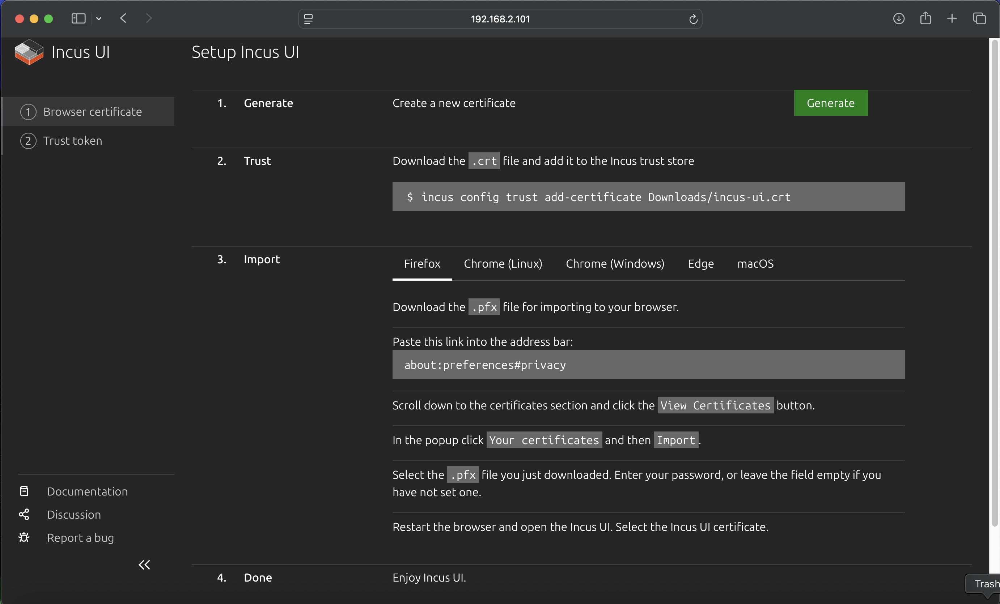

# Setting Up IncusOS on Intel NUC

This guide walks you through installing and configuring [IncusOS](https://linuxcontainers.org/incus-os/docs/main/getting-started/) on an [Intel NUC](https://www.intel.com/content/www/us/en/products/boards-kits/nuc.html) device. IncusOS is a dedicated operating system designed specifically for running Incus, providing a streamlined platform for container and virtual machine management.

## Overview

Installing IncusOS on an Intel NUC involves:

1. **Preparing the workspace**: Setting up the Windsor workspace and context
2. **Acquiring the IncusOS image**: Downloading the IncusOS image from the customizer
3. **Setting environment variables**: Configuring workspace variables including the image path
4. **Preparing the NUC**: Updating BIOS, configuring Secure Boot, and wiping existing storage
5. **Creating the boot media**: Writing the IncusOS image to a USB device
6. **Booting and installing**: Booting from USB and installing IncusOS to the NUC's storage
7. **Connecting to Incus**: Setting up the Incus CLI client and connecting to the server

IncusOS provides a complete, dedicated operating system optimized for running Incus, making it ideal for production deployments where you want a minimal, purpose-built platform.

## Prerequisites

Before starting, ensure you have:

- **Intel NUC device**: Compatible Intel NUC (x86_64 architecture, 5 years old or newer)
- **USB memory device**: At least 8GB capacity (16GB or larger recommended) for the boot media
- **Computer with macOS or Linux**: For preparing the boot media and running the Incus CLI
- **Network connectivity**: The Intel NUC must be able to connect to your network via Ethernet
- **TPM 2.0**: The NUC must have a TPM 2.0 security module
- **UEFI with Secure Boot support**: Required for IncusOS installation
- **At least 50GiB of storage**: On the NUC's internal storage device
- **Physical access**: To the NUC for BIOS configuration and boot media insertion
- **Workspace initialized**: Follow the [Initialize Workspace](../workspace/init.md) runbook if you haven't already

## System Requirements

IncusOS requires modern system features and will not function properly on older unsupported systems:

- Modern x86_64 or ARM64 system (5 years old at most)
- Support for UEFI with Secure Boot
- TPM 2.0 security module
- At least 50GiB of storage
- At least one wired network port

## Step 1: Initialize Workspace and Context

### Create Workspace (if not already done)

If you haven't already initialized a workspace, follow the [Initialize Workspace](../workspace/init.md) runbook:

```bash
task workspace:initialize -- incus ../incus
cd ../incus
```

### Initialize Windsor Context

Create a new context called "incus":

```bash
windsor init incus
```

Verify the context is set:

```bash
windsor context get
```

## Step 2: Acquire IncusOS Image

### Download from IncusOS Customizer

Visit the [IncusOS Customizer](https://incusos-customizer.linuxcontainers.org/ui/) to create a custom IncusOS image tailored to your needs.

1. Configure your image settings (storage, network, etc.)
2. Download the generated image file (typically named like `IncusOS_YYYYMMDDHHMM.img`)

**Note**: After downloading, note the full path to the image file. You'll need this path for the environment variable in Step 3.

## Step 3: Set Environment Variables

### Determine the Target Disk for Image Copy

Use the `task device:list-disks` command to get a list of disks. Set the `USB_DISK` environment variable as shown below.

### Add these lines to ./contexts/incus/windsor.yaml

```yaml
environment:
  USB_DISK: "/dev/disk4"
  
  # Path to the downloaded IncusOS image file
  INCUS_IMAGE_FILE: "/Users/$USER/Downloads/IncusOS_202512250102.img"
  INCUS_REMOTE_IP_0: 192.168.2.101
```

**Note**: Replace the placeholder values with your actual configuration:
- `USB_DISK`: The device identifier for your USB memory device (use `task device:list-disks` to identify it)
- `INCUS_IMAGE_FILE`: The path to your downloaded IncusOS image file (from Step 2)
- `INCUS_REMOTE_IP_0`: IP for a remote incus server

### Prepare Image in Workspace

Use the taskfile command to copy the downloaded image to the workspace devices folder:

```bash
task device:download-incus-image
```

This will copy the image file specified in `INCUS_IMAGE_FILE` to `contexts/<context>/devices/incus/incusos.img`.

## Step 4: Prepare the Intel NUC

### Update the BIOS

Before installing IncusOS, ensure your NUC's BIOS is up to date. Visit the manufacturer's support page for your specific NUC model to download the latest BIOS:

- **ASUS NUC8i5BEH**: [BIOS Downloads](https://www.asus.com/supportonly/nuc8i5beh/helpdesk_bios/)

Download and install the latest BIOS update following the manufacturer's instructions.

### Wipe Existing Storage

If the NUC previously had Ubuntu or another operating system installed, you should wipe the storage device before installing IncusOS. This ensures a clean installation without bootloader or partition conflicts.

**Warning**: This will destroy all data on the storage device. Ensure you have backups of any important data.

```bash
# On the NUC (or from another system via SSH)
# Identify the storage device first
lsblk
# or
sudo fdisk -l

# Wipe the partition table (replace /dev/nvme0n1 with your device)
sudo wipefs -a /dev/nvme0n1

# Alternative: Zero the first few MB to destroy partition table
sudo dd if=/dev/zero of=/dev/nvme0n1 bs=1M count=10
```

**Note**: After wiping, if you reboot the NUC, you should see "No bootable device found" - this confirms the storage has been wiped and is ready for IncusOS installation.

### Configure Secure Boot

Access the NUC's BIOS settings (typically by pressing F2 during boot):

1. Navigate to the **Boot** tab in BIOS settings
2. In the **Secure Boot** section:
   - Select **"Custom"** Secure Boot Mode
   - Select **"Reset to Setup Mode"** to enable custom mode
3. In the **Boot Priority** section:
   - Select **"Boot USB devices First"** to prioritize USB boot
   - Enable **"USB"** booting if not already enabled

**Important**: Secure Boot must be configured in "Custom" mode for IncusOS to install and boot properly.


## Step 5: Prepare USB Boot Device

### Write IncusOS Image to USB

Write the IncusOS image to your USB memory device. This process will erase all existing data on the device.

**Single disk** (default):
```bash
task device:write-incus-disk
```

**Multiple disks**: To write the image to multiple disks simultaneously, specify the total number of disks. For example, to write to 2 disks starting from the disk specified in `USB_DISK`:

```bash
task device:write-incus-disk -- 3
```

This will write to the base disk (e.g., `/dev/disk4`) and the next sequential disk (e.g., `/dev/disk5`). The `USB_DISK` environment variable should be set to the first disk in the sequence.

### Eject the USB Device

After writing completes, safely eject the device(s):

**Single disk** (default):
```bash
task device:eject-disk
```

**Multiple disks**: To eject multiple disks, specify the total number of disks:

```bash
task device:eject-disk -- 3
```

The `eject-disk` task will automatically unmount the disks before ejecting them.

## Step 6: Boot and Install IncusOS

1. **Insert the boot media**: Insert the USB memory device into a USB port on your Intel NUC
2. **Connect network**: Ensure the Intel NUC is connected to your network via Ethernet
3. **Power on**: Connect power to the Intel NUC and turn it on
4. **Boot from USB**: The NUC should automatically boot from USB if configured correctly, or use the boot menu (typically F10) to select the USB device
5. **Wait for installation**: IncusOS will boot and begin installation to the internal storage device
6. **Note the IP address**: After installation completes, the NUC will display its IP address on the console, or you can find it via your router's DHCP client list

**Note**: The installation process will automatically install IncusOS to the internal storage device. After installation completes and the system reboots, you can remove the USB boot device.

## Step 7: Install Incus CLI Client

On your development system (macOS or Linux), install the Incus CLI client:

```bash
# macOS (using Homebrew)
brew install incus

# Linux (Ubuntu/Debian)
sudo snap install incus

# Or build from source (see Incus documentation)
```

Verify the installation:

```bash
incus version
```

## Step 8: Connect to Incus Server

### Add the Remote Server

Add your Incus server as a remote:

```bash
incus remote add <remote-name> https://<nuc-ip-address>:8443
```

Replace:
- `<remote-name>` with a name for this remote (e.g., `nuc`, `incus-server`, `forest-shadows`)
- `<nuc-ip-address>` with the actual IP address of your NUC (e.g., `192.168.2.101`)

Example:

```bash
incus remote add nuc https://192.168.2.101:8443
```

### Set the remote's url

When adding the remote, you'll be prompted to accept the server's certificate. Type `yes` to trust the certificate.

If you need to trust the certificate later:

```bash
incus remote set-url <remote-name> https://<nuc-ip-address>:8443
```

### Verify Connection

List your remotes to verify the connection:

```bash
incus remote list
```

You should see your new remote listed. Test the connection:

```bash
# List instances (should be empty initially)
incus list <remote-name>:

# Get server information
incus info <remote-name>:
```

### Set as Default Remote

IMPORTANT: The following steps rely on setting the current remote to the nuc

If you want to make this your default remote:

```bash
incus remote switch <remote-name>
```

After switching, you can omit the remote name in commands:

```bash
incus list
incus info
```

### Access Incus Web UI

Incus provides a web-based user interface that you can access through your browser. To use the web UI, you'll need to set up browser certificate authentication.

#### Access the Setup Page

Open your web browser and navigate to:

```
https://<nuc-ip-address>:8443
```

Replace `<nuc-ip-address>` with your NUC's IP address (e.g., `https://192.168.2.101:8443`).

You'll be presented with the Incus UI setup page, which guides you through the certificate setup process:



#### Step 1: Generate Certificate

1. On the setup page, click the **"Generate"** button in the "1. Generate" section
2. This creates a new certificate for browser access
3. The certificate files (`.crt` and `.pfx`) will be available for download

#### Step 2: Trust Certificate (CLI)

Add the certificate to the Incus CLI trust store so you can use the CLI with the same certificate:

```bash
# Download the .crt file first, then add it to trust store
incus config trust add-certificate /Users/$USER/Downloads/incus-ui.crt
```

Replace `/Users/$USER/Downloads/incus-ui.crt` with the actual path where you downloaded the certificate file.

#### Step 3: Import Certificate to Browser

To access the Incus UI through your browser, you need to import the certificate into your browser:

1. **Download the `.pfx` file** from the setup page
2. **Import into your browser** (instructions vary by browser):

   **Firefox:**
   - Navigate to `about:preferences#privacy` in the address bar
   - Scroll down to the "Certificates" section
   - Click **"View Certificates"**
   - In the popup, click **"Your certificates"** tab
   - Click **"Import"**
   - Select the `.pfx` file you downloaded
   - Enter the password (or leave empty if no password was set)
   - Restart Firefox

   **Chrome/Edge (Linux/Windows):**
   - Open browser settings
   - Navigate to Privacy and Security → Security → Manage certificates
   - Click **"Your certificates"** tab
   - Click **"Import"**
   - Select the `.pfx` file
   - Enter the password if prompted
   - Restart the browser

   **macOS (Safari/Chrome):**
   - Open Keychain Access application
   - Select "login" keychain
   - Go to File → Import Items
   - Select the `.pfx` file
   - Enter the password if prompted
   - Restart your browser

3. **Restart your browser** after importing the certificate
4. **Access the Incus UI**: Navigate to `https://<nuc-ip-address>:8443` again
5. **Select the certificate**: When prompted, select the Incus UI certificate you just imported

#### Step 4: Using the Web UI

Once the certificate is imported and you've restarted your browser, you can:

- Access the Incus UI at `https://<nuc-ip-address>:8443`
- Manage instances (containers and VMs) through the web interface
- View storage pools, networks, and profiles
- Monitor system resources and instance status
- Create, start, stop, and delete instances
- Access instance consoles

The web UI provides a graphical interface for all Incus operations, making it easy to manage your infrastructure without using the command line.


## Step 9: Get Client Certificate (Optional)

If you need to retrieve the client certificate for authentication or documentation purposes:

```bash
incus remote get-client-certificate <remote-name>
```

This will display the client certificate that was generated when you first connected to the server.

## Verification

Verify your Incus installation is working correctly:

```bash
# Check server information
incus info

# List storage pools
incus storage list

# List networks
incus network list

# List available images
incus image list images:

# Test creating an instance
incus launch images:ubuntu/22.04 test-instance
incus list
incus delete test-instance
```

Your Incus server should be fully operational and ready for use.

## Getting Device Information

When working with Incus, you may need to identify storage devices by their persistent IDs rather than device names like `/dev/nvme0n1`. Incus uses persistent device identifiers to ensure consistent device naming.

### List Devices by ID

```bash
# List all devices with persistent IDs
ls -la /dev/disk/by-id/

# Filter for NVMe devices
ls -la /dev/disk/by-id/ | grep nvme

# Filter for SATA devices
ls -la /dev/disk/by-id/ | grep sda
```

Example output:
- `nvme-WD_BLACK_SN850X_1000GB_23436M801614` - NVMe device with model and serial
- `nvme-eui.e8238fa6bf530001001b448b4ce05e8e` - NVMe EUI identifier
- `ata-SPCC_Solid_State_Disk_AA230815S325622103` - SATA device identifier

These persistent IDs are useful when configuring storage pools or referencing devices in Incus configurations, as they remain consistent across reboots and system changes.

## Troubleshooting

### NUC Not Booting from USB

- Verify USB boot is enabled in BIOS/UEFI settings
- Check that "Boot USB devices First" is selected in boot priority
- Try a different USB port on the NUC
- Verify the image was written correctly to the USB device
- Ensure the USB device is properly formatted and recognized by the BIOS

### Secure Boot Issues

- Verify Secure Boot is set to "Custom" mode, not "Standard"
- Ensure "Reset to Setup Mode" has been selected
- Check that the IncusOS image supports Secure Boot (modern images should)
- If issues persist, try disabling Secure Boot temporarily to test, then re-enable

### Cannot Connect to Incus Server

- Verify the NUC has network connectivity (check Ethernet connection)
- Check that the IP address is correct
- Ensure port 8443 is not blocked by firewall
- Verify the Incus service is running on the NUC: `systemctl status incus` (if you have console access)
- Try accessing the web UI: `https://<nuc-ip-address>:8443` in a browser

### Installation Fails

- Verify the storage device has at least 50GiB of free space
- Check that the storage device was properly wiped before installation
- Ensure TPM 2.0 is available and enabled in BIOS
- Verify the NUC model is compatible (x86_64, 5 years old or newer)
- Check console output for specific error messages

### Wiping the Boot Disk Using Ubuntu Live USB

If you need to completely wipe the NUC's boot disk to start fresh (for example, if IncusOS installation failed or you want to reinstall), you can use an Ubuntu Live USB to boot into a recovery environment and wipe the disk.

#### Step 1: Download Ubuntu ISO

Download the Ubuntu Desktop ISO from the official website:
- [Ubuntu Desktop Download](https://ubuntu.com/download/desktop)

#### Step 2: Create Bootable USB

Create a bootable USB drive with the Ubuntu ISO:

```bash
# Identify your USB device
task device:list-disks

# Write Ubuntu ISO to USB (replace disk4 with your USB device)
# macOS
sudo dd if=/Users/$USER/Downloads/ubuntu-*.iso of=/dev/rdisk4 bs=4M conv=fsync status=progress

# Or use Balena Etcher for easier GUI method
```

**Note**: This will erase all data on the USB device.

#### Step 3: Boot from USB

1. Insert the Ubuntu Live USB into the NUC
2. Power on the NUC
3. Access the boot menu (typically F10 or F12) or set USB as first boot option in BIOS
4. Select the USB device to boot from
5. Turn off Secure Boot
6. When Ubuntu loads, choose **"Try Ubuntu"** (do not install)

#### Step 4: Wipe the Disk

Once booted into Ubuntu Live, open a terminal and run:

```bash
# List all disks to identify the NUC's internal storage
sudo lsblk
# or
sudo fdisk -l

# Identify your disk (typically /dev/nvme0n1 for NVMe or /dev/sda for SATA)
# Wipe the partition table (quick method)
sudo wipefs -a /dev/nvme0n1

# Or zero the first 10MB to destroy partition table (also quick)
sudo dd if=/dev/zero of=/dev/nvme0n1 bs=1M count=10

# Verify the disk is wiped
sudo fdisk -l /dev/nvme0n1
# Should show "does not contain a valid partition table"
```

**Warning**: Replace `/dev/nvme0n1` with your actual disk device. Be absolutely certain you're targeting the correct disk, as this operation is destructive and cannot be undone.

**Important Notes**:
- The `wipefs` command only removes partition table metadata (quick, ~1 second)
- The `dd` command zeros the first 10MB (takes a few seconds, more thorough)
- For a complete wipe of the entire disk, use: `sudo dd if=/dev/zero of=/dev/nvme0n1 bs=1M status=progress` (this takes much longer)

After wiping, you can:
- Reboot and install IncusOS from USB again
- Install a different operating system
- Leave the disk empty for a fresh start

### Certificate Errors

- Verify the server's certificate hasn't changed (may indicate a different server)
- Check system time is correct on both client and server

## Next Steps

After successfully installing IncusOS:

1. **Create storage pools**: Set up storage pools for your instances
2. **Configure networks**: Set up bridge networks for instance connectivity
3. **Launch instances**: Create containers and virtual machines
4. **Set up profiles**: Create instance profiles for common configurations
5. **Configure backups**: Set up automated backups for your instances
6. **Explore features**: Learn about snapshots, migrations, and clustering

## Example: Launching and Accessing an Instance

This section demonstrates how to launch an Incus instance and connect to it via SSH.

### Launch an Instance

Launch a new container instance on the remote Incus server you just set up. To launch on a remote server, prefix the instance name with the remote name followed by a colon:

```bash
# Launch an Ubuntu 22.04 container named "my-container" on the remote server
incus launch images:ubuntu/22.04 <remote-name>:my-container
```

Replace `<remote-name>` with the name you used when adding the remote (e.g., if you added the remote as `nuc`, use `nuc:my-container`).

**Important**: Do not use the `--target` flag when launching instances on a remote server unless you have a clustered setup. Using `--target` on a non-clustered remote will result in the error: `Error: Failed instance creation: Target only allowed when clustered`.

The instance will start automatically after creation. You can verify it's running:

```bash
# List all instances on the remote
incus list <remote-name>:

# Get detailed information about the instance
incus info <remote-name>:my-container
```

If you've set the remote as your default (using `incus remote switch <remote-name>`), you can omit the remote name prefix:

```bash
# If remote is set as default, you can launch without the prefix
incus launch images:ubuntu/22.04 my-container

# List instances
incus list

# Get instance info
incus info my-container
```

### Configure SSH Access

To SSH into the container, you'll need to set up SSH access. There are a few approaches:

#### Option 1: Using Incus Exec (No SSH Required)

The simplest way to access the container is using `incus exec`. Remember to include the remote name prefix:

```bash
# Execute a bash shell in the container on the remote
incus exec <remote-name>:my-container -- bash

# Execute any command
incus exec <remote-name>:my-container -- ls -la
incus exec <remote-name>:my-container -- apt update
```

If the remote is set as default, you can omit the remote name prefix.


### Example: Complete Workflow

Here's a complete example of launching a container on the remote server, setting it up, and accessing it:

```bash
# 1. Launch the container on the remote server
incus launch images:ubuntu/22.04 <remote-name>:test-server

# 2. Wait for it to start (usually instant)
incus list <remote-name>:test-server

# 3. Access the container

# Use incus exec (recommended, simplest)
incus exec <remote-name>:test-server -- bash


# 4. When done, stop and delete the container
incus stop <remote-name>:test-server
incus delete <remote-name>:test-server
```

**Note**: Replace `<remote-name>` with your actual remote name (e.g., `nuc`, `incus-server`, etc.). If you've set the remote as default, you can omit the remote name prefix in all commands.

### Accessing Virtual Machines

If you're using virtual machines instead of containers, the process is similar but VMs have their own IP addresses on your network:

```bash
# Launch a VM on the remote server
incus launch images:ubuntu/22.04 my-vm --vm

# Get VM information
incus info my-vm

# Access via console (if SSH isn't configured)
incus console my-vm

```

## Additional Resources

- [Incus Documentation](https://linuxcontainers.org/incus/docs/main/)
- [IncusOS Customizer](https://incusos-customizer.linuxcontainers.org/ui/)
- [Installing Incus on Ubuntu](https://github.com/lxc/incus/blob/main/doc/installing.md)
- [Initialize Workspace Runbook](../workspace/init.md)
